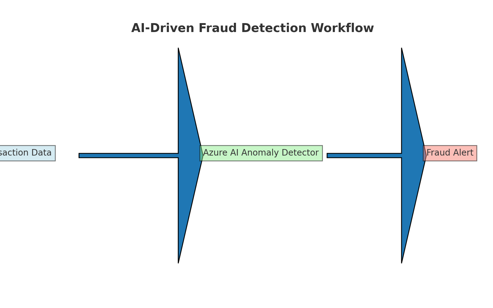
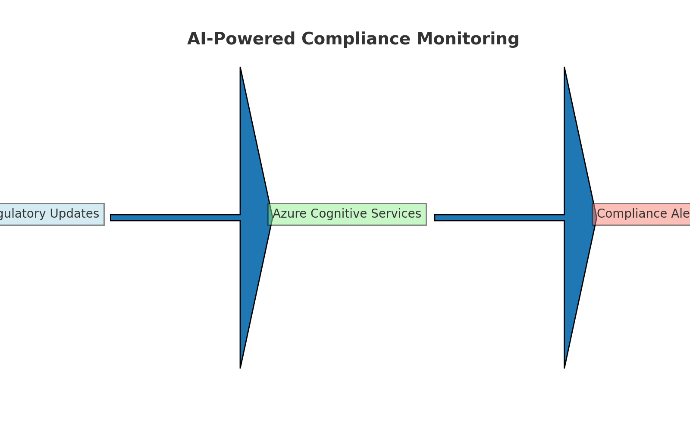

⭐ Featured Hero Project  
**AI-Powered Financial Compliance & Risk Insights**  
Real-time fraud alerts, loan risk scoring, and compliance summaries in one pane of glass.  
➡️ https://github.com/gcmbell14/ai-compliance-risk-insights

# 💼 AI in Finance Portfolio

This portfolio showcases **practical AI applications** in the **banking and financial services industry**, designed to demonstrate skills in:

- **AI & Machine Learning** (Azure AI, Azure Machine Learning, OpenAI GPT)
- **Data Integration** (SQL, APIs, ETL)
- **Business Intelligence** (Power BI, dashboarding)
- **Regulatory & Compliance AI**

Each project includes:  
✅ Business Problem & AI Solution  
✅ Dataset & Tools Used  
✅ Implementation Steps  
✅ Results & Visuals

---

## 📊 Projects

### 1️⃣ [AI-Driven Fraud Detection](fraud-detection/README.md)
Real-time fraud detection using **Azure AI** (anomaly detection + features like velocity, geo distance, device change) and **Power BI** dashboards.

**Visual:**  

---

### 2️⃣ [AI-Enhanced Loan Risk Scoring](loan-risk-scoring/README.md)
Credit risk classification with **Azure Machine Learning** (e.g., logistic regression/GBM), **explainability**, and an underwriting handoff view.

**Visual:**  

---

### 3️⃣ [AI-Powered Compliance Monitoring](compliance-monitoring/README.md)
Automated monitoring of **AML, KYC, and regulatory updates** using **Azure Cognitive Services** and **OpenAI GPT** with executive summaries.

**Visual:**  

---

## 🛠️ Tools & Technologies
- **AI Platforms:** Azure AI, Azure ML, Azure Cognitive Services, OpenAI GPT  
- **Languages:** Python (Pandas, scikit-learn, NLTK), SQL  
- **Data Visualization:** Power BI, Matplotlib  
- **Integration:** APIs, Azure Functions, ETL pipelines

---

## 👤 About the Author
**Bill Bell (gcmbell14)** – IT Manager & Business Analyst with 15+ years in **enterprise data, banking, and financial services**. I build **AI for fraud, risk, and compliance**.

📬 **LinkedIn:** https://www.linkedin.com/in/bill-bell-CSM-76a7a07/
