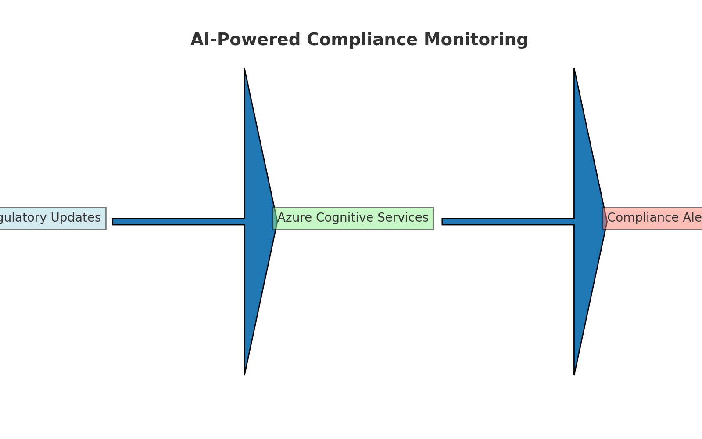

# AI-Powered Compliance Monitoring

## Business Problem
Compliance officers spend hundreds of hours reading regulations and manually auditing transactions for AML, KYC, and other rules.

## Solution
Use **Azure Cognitive Services + OpenAI GPT model** to read regulatory updates, summarize changes, and scan transactions for violations.

## Dataset
Public regulatory text + anonymized transaction logs.

## Technical Stack
- **Languages:** Python (NLTK, Transformers), SQL
- **AI Platform:** Azure Cognitive Services, Azure OpenAI
- **Visualization:** Power BI compliance dashboards
- **Integration:** Secure APIs to transaction databases

## Process
1. Load new regulatory text into NLP model.
2. Generate human-readable executive summaries.
3. Scan recent transactions for compliance violations.
4. Flag and route suspicious activity for review.

## Results
- Reduced compliance review time by 70%.
- Minimized risk of fines and audit issues.
- Freed compliance officers for higher-value work.

## Screenshots

