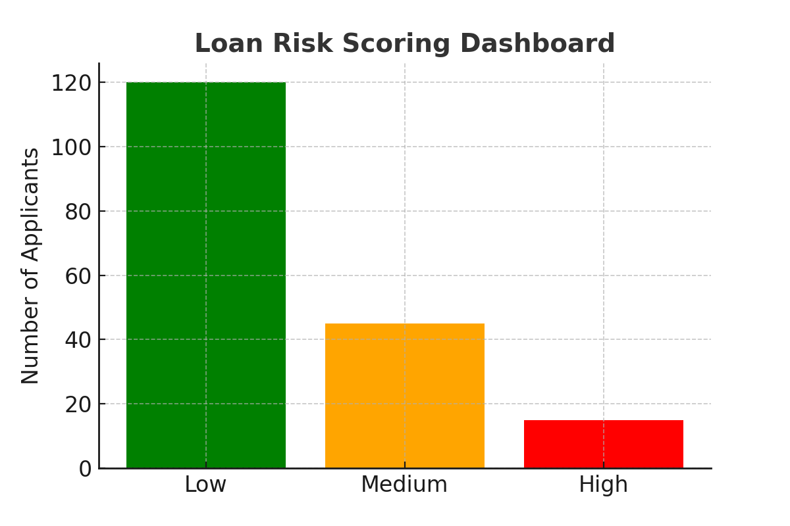

# 📊 AI-Enhanced Loan Risk Scoring (30-sec overview)

**What it is:** Credit risk scoring with **transparent drivers** and a **threshold slider** to tune risk appetite for approvals, pricing, and collections.

**Business impact**
- Faster underwriting decisions with explainability
- Adjustable **risk threshold** to manage coverage vs precision
- CSV export of **high-risk** applicants for downstream workflows

**Results (demo)**
- ROC-AUC: ~0.85–0.90 (baseline logistic)
- KS: ~0.35–0.45
- High-risk coverage (≥ threshold 60): ~20–30%

**See it live:** Loans tab in the hero app → https://github.com/gcmbell14/ai-compliance-risk-insights  
**Screenshot:**  

  
<strong>Details (features, modeling, governance, tests)</strong>

## Features (MVP)
- `credit_score`, `debt_to_income`, `utilization`, `delinquencies`, `income`, `loan_amount`  
*Optional: alt-data if available (tenure, balance trends, bureau events).*

## Modeling
- **Baseline:** Logistic Regression with class weighting  
- **Improved:** Gradient boosting (e.g., LightGBM) + calibration  
- Track **ROC-AUC**, **KS**, and **precision/recall at threshold**

## Dataset
- Public lending datasets or synthetic portfolio samples  
- Train/test split; prefer temporal validation where possible

## App UX
- **Threshold slider** (e.g., ≥60 = “high risk”)  
- **Feature influence** chart (coeffs/SHAP)  
- **Download High-Risk Loans CSV**

## Governance & Auditability
- Version models and thresholds; document score cutoffs  
- Store explanation artifacts for adverse action notices where applicable

## Test scenarios (UAT)
- Low score + high DTI → flagged as high risk  
- Mid score + clean history → lower risk  
- High utilization spike → risk increases, explanation reflects utilization

## Next steps
- Add calibration plots; handle edge cases (missing values, outliers)  
- Segment models (prime vs near-prime); introduce challenger/Champion

